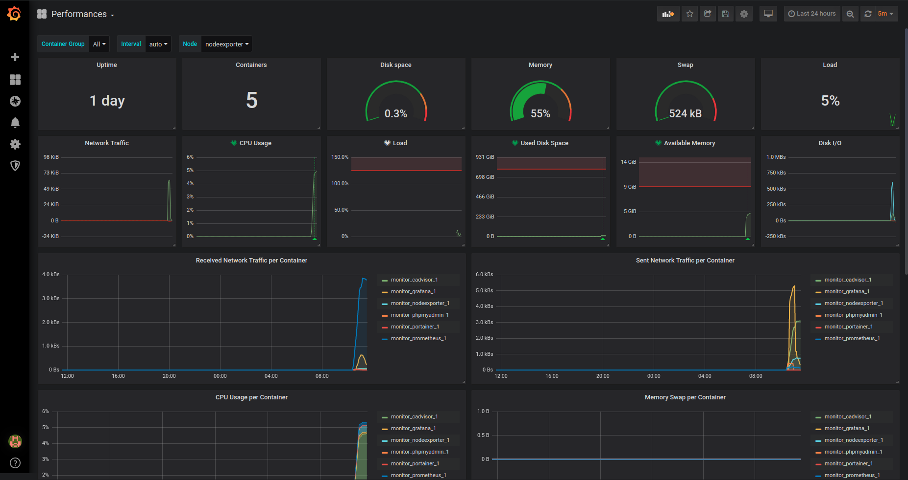

# KMP Docker Monitoring

This is a simple Docker Environment for monitoring server and containers.



## Install

First, add the environment variable to configure the Grafana password :
```bash
export GRAFANA_ADMIN_PASSWORD="your-password"
```

Then clone the repository and start the docker environment.

```bash
git clone git@github.com:kerwanp/KMP-Docker-Monitoring.git
cd KMP-Docker-Monitoring
docker-compose up
```

You can access to portainer at yourhost:9000 and to yourhost:9001.
You can find grafana dashboards made for the environment in `grafana/dashboards`.
